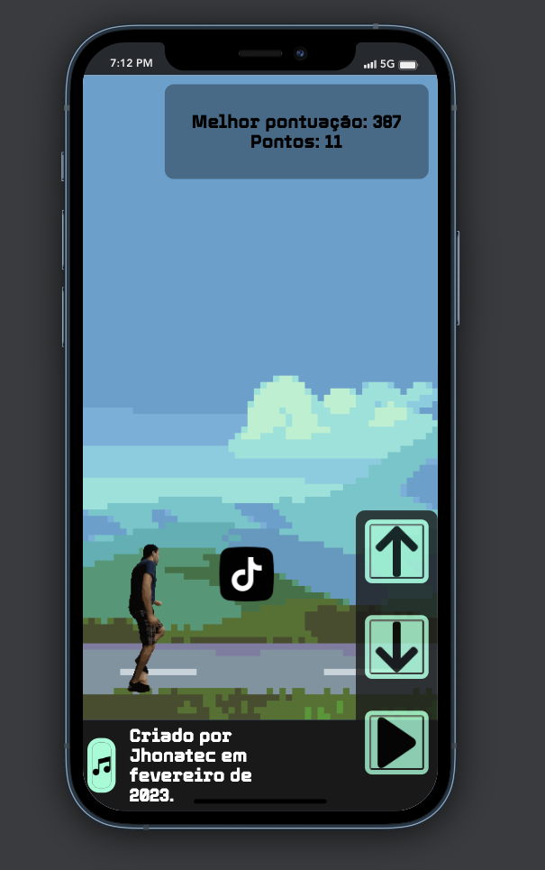

# javascriptation by Jhonatec
A game page like Dino from Google only using HTML / CSS / JS

## See online
<a href="https://javascriptation.jhonatec.dev/" target="_blank">Click here to open the preview</a>

### Mobile ready

# Functionalities
- Pause all objects at once
- Background music
- GIFs for character walking, jumping and GamerOver
- Answer via keys or buttons to the mobile
- Media query for smaller screens (mobile)
- Background that changes color (CSS filters)
- Obstacles with random order, speed and position.

# Used techs
- HTML
- CSS
  - Media Query
  - Animations
  - Filter
- JavaScript
  - Character actions
  - Move objects
  - Calculate points
  - Change the scenario
  - Show Game Over messages based on the object hit
  - Trigger audio events based on events
